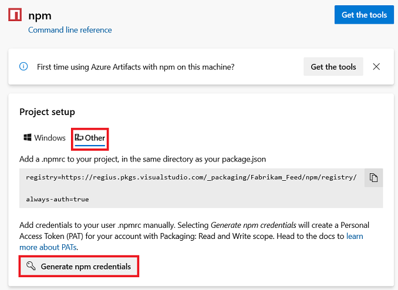
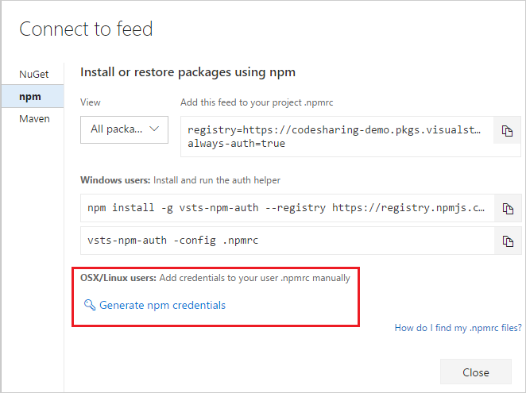

The **Connect to feed** dialog box generates an appropriately formatted token that you can place into your .npmrc file with a lifespan of 90 days.

>  If you want to create a token that lasts _longer than 90 days_, skip to the second of the following methods.

**90-day token:**

::: moniker range=">= azure-devops-2019"

1. From **Azure Artifacts**, select **Connect to feed**.

2. Select **npm**.

3. Select **Other** in the **Project setup** section.

4. Select **Generate npm credentials**. Copy the credentials to add them to your user .npmrc file manually:

   > [!div class="mx-imgBorder"] 
   >
   > 

::: moniker-end

::: moniker range=">=tfs-2017 < azure-devops-2019"

1. From the **Packages** page, select **Connect to feed**.

2. Select **npm**.

3. Select **Generate npm credentials**. Copy the credentials to add them to your user .npmrc file manually:

    

::: moniker-end

**Create a token that lasts longer than 90 days:**

1. Browse to security and generate a [PAT](../../../organizations/accounts/use-personal-access-tokens-to-authenticate.md) with a narrow scope of "Packaging (read and write)."

2. Base64 encode the PAT.

    # [Windows](#tab/windows)
    ```powershell
    [Convert]::ToBase64String([system.Text.Encoding]::UTF8.GetBytes("YOUR_PAT_GOES_HERE"))
    ```

    # [Mac](#tab/mac)
    ```
    echo -n "YOUR_PAT_GOES_HERE" | base64
    ```

3. In your $home/.npmrc file, add the following lines. Replace `yourorganization` and `yourfeed`, and add your username (can be anything except empty), PAT, and email.

   ```ini
   //pkgs.dev.azure.com/<yourorganization>/_packaging/<yourfeed>/npm/registry/:username=ANYTHING-BUT-EMPTY
   //pkgs.dev.azure.com/<yourorganization>/_packaging/<yourfeed>/npm/registry/:_password=BASE64-ENCODED-PAT-GOES-HERE
   //pkgs.dev.azure.com/<yourorganization>/_packaging/<yourfeed>/npm/registry/:email=YOUREMAIL@EXAMPLE.COM
   //pkgs.dev.azure.com/<yourorganization>/_packaging/<yourfeed>/npm/registry/:always-auth=true
   ```
