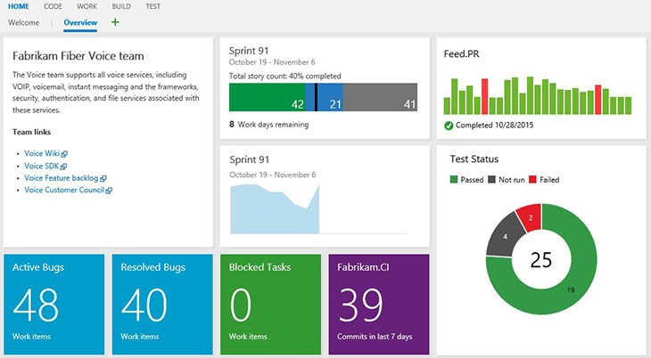
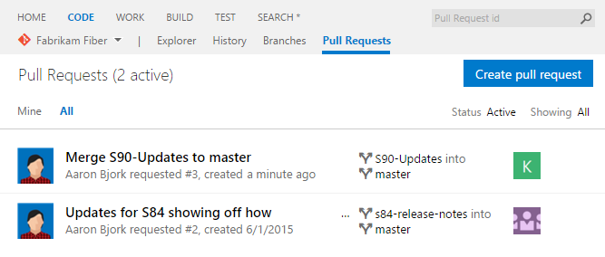
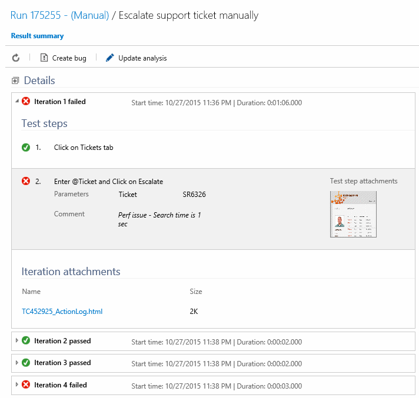
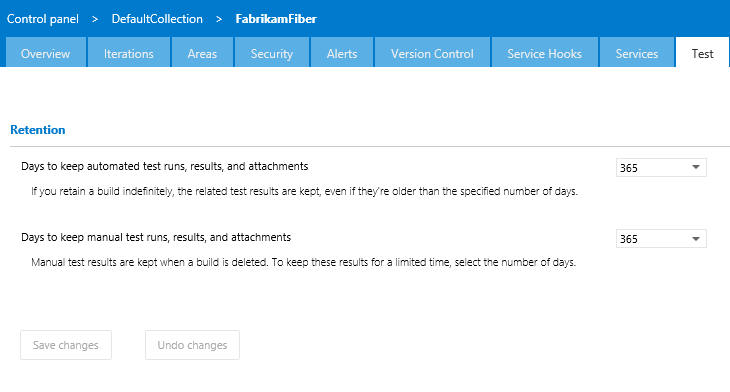
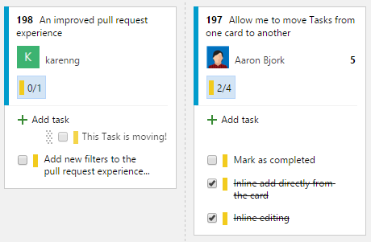

# Dashboards, improved pull requests, test results and more – Oct 30

## Dashboards

I’m excited to announce that we have released our [dashboards feature](https://blogs.msdn.com/b/visualstudioalm/archive/2015/08/26/agile-project-management-futures-august-2015.aspx) in Visual Studio Online! Dashboards are a customizable canvas and replace your existing Team Overview page. They enable your team to visualize status and monitor progress across your project.

- **Create multiple dashboards.** Until now, the Team Overview page was the only page that teams could use to pin widgets. Now, as a team admin, you can create multiple dashboards using the plus (+) button next to an existing dashboard or through the dashboard manager. The dashboard manager is accessible through the settings icon on the dashboard.
- **Customizable dashboards.** The existing project home pages are now a completely customizable experience, giving you full control of all the data on your screen. As a team admin, you can rearrange, remove, or add the widgets that you want and use. A new widget catalog is accessible to team admins through the large green plus (+) button at the lower right side of the dashboard.
- **New dashboard widgets.** All the pieces of data that used to be available on the previous Team Overview page are now available through the widget catalog. You can still add multiple charts to the dashboard through the Work, Test, and Build hubs. In addition, we’ve brought new widgets into the catalog: a conditional query tile (that allows you to set red or green if the number of work items crosses a threshold); a code tile (recent commits in the last seven days); a query results widget (allows you to see all work items from a query); and a markdown widget (enables custom text, images, and links).

We are continuing to invest in additional widgets that pull data from all parts of the production: Work, Code, Build, Test, and Release. Widgets are written as [extensions](/azure/devops/integrate/), allowing you to write and share your own widgets. As we continue to roll in this space, we’d love to hear what kinds of widgets you’d like to see us invest in. If you’ve got feedback here, please reach out to us at [dashboard-feedback@microsoft.com](mailto:dashboard-feedback@microsoft.com) and continue to help us build an incredible product.

## Improved pull request experience

We made a set of changes this sprint to improve the existing pull request experience to make it easier for you to find the pull requests you care about and remove the noise. The pull request hub now has additional filters to help find PRs that are “Mine” (assigned to me, created by me, assigned to your team) or “All”. In addition, PR discussions allow hiding of unwanted system messages, and options allow you to customize the merge message and delete the source branch.

We really want to make sure we have a simple to use pull request experience, so let us know if we got it right.

## Manual test iteration results

You can now view manual test results, including test step outcomes, test attachments and comments in the Runs tab in the Test hub group. Previously, viewing this detailed test result information was possible only with Microsoft Test Manager (MTM). To get started, open the Recent Test Results pane and then open a test result.

## Retention policy for test results

We've simplified test result data cleanup and removed the dependency on tools like the Test Attachment Cleaner. With the new feature to manage test result retention policies, you can now clean up all test result data in the system, including test runs, test results, and test attachments that are older than a specified number of days. This retention policy is configured at a team project level. You can specify separate policies for automated and manual test results, offering the flexibility to retain manual test results longer than automated test results.

We are also integrating test retention with the retention policy of the new build system (Build vNext) by adding functionality to delete test results when builds are deleted. More information about this feature is available on the [Visual Studio devops blog](https://blogs.msdn.com/b/visualstudioalm/archive/2015/10/08/test-result-data-retention-with-team-foundation-server-2015.aspx).

## Reorder and re-parent tasks from the Kanban board

We’ve introduced the ability to reorder and re-parent tasks within a checklist direction from the Kanban board, making it easier to manage tasks.

## Extensibility on the work item form

For those of you eager to get started writing [extensions](/azure/devops/integrate/), the ability to extend both the existing and the new work item form is now available! The open extensibility points include:

- New page contributions shown as an additional page on the work item form
- New group contributions will be added as a group in the form
- New action contributions will be added as a toolbar button

## PREVIEW: Updates to the new work item form

Last sprint we released a preview of the new work item form. Since then, we’ve received feedback that the state field feels too much like a label, which causes discoverability issues. So we’ve enabled state coloring in the new work item form to differentiate the first, middle, and last states to create a visual language for this field.

Please reach out on Twitter ([@karenkayliu](https://twitter.com/karenkayliu)) if you have thoughts, comments, or questions about anything described here. And please help us prioritize by heading over to [Azure DevOps Developer Community](https://developercommunity.visualstudio.com/spaces/21/index.html) to add your idea or vote for an existing one.

Thanks,

Karen Ng
